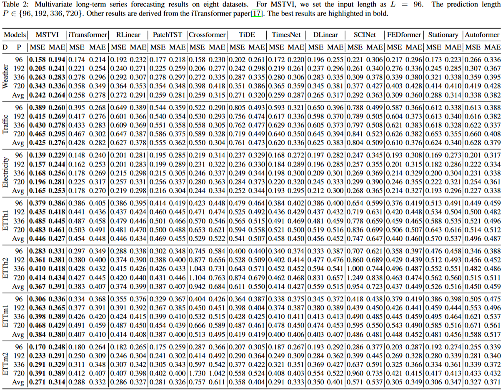

# MSTVI

This is the official implementation of paper "MSTVI: Multi-Scale Time-Variable Interaction for Multivariate Time Series Forecasting".

## Main Experiment


## Start
1. Install Python 3.10. For convenience, execute the following command.

```
pip install -r requirements.txt
```

2. Prepare Data. You can obtain the well pre-processed datasets from [[Google Drive]](https://drive.google.com/drive/folders/13Cg1KYOlzM5C7K8gK8NfC-F3EYxkM3D2?usp=sharing). Then place the downloaded data in the folder`./dataset`.

3. Train and evaluate model. We provide the experiment scripts for all benchmarks under the folder `./scripts/`. You can reproduce the experiment results as the following examples:

```
# long-term forecast
bash scripts/long_term_forecast/MSTVI/traffic.sh
```

## Contact
If you have any questions or suggestions, feel free to contact our maintenance team:
- Quangao Liu (liuquangao@sia.cn)
- Ruiqi Li (liruiqi1@sia.cn)
- Maowei Jiang (jiangmaowei@sia.cn)

Or describe it in Issues.


## Citation

If you find this repo useful, please cite our paper
```
@inproceedings{liu2024mstvi,
  title={MSTVI: Multi-Scale Time-Variable Interaction for Multivariate Time Series Forecasting},
  author={Quangao Liu and Ruiqi Li and Maowei Jiang and Wei Yang and Cheng Liang and Zhuozhang Zou},
  year={2024},
}
```
## Acknowledgement

Our code is based on Time Series Library (TSLib)：https://github.com/thuml/Time-Series-Library

# MSTVI
# MSTVI
